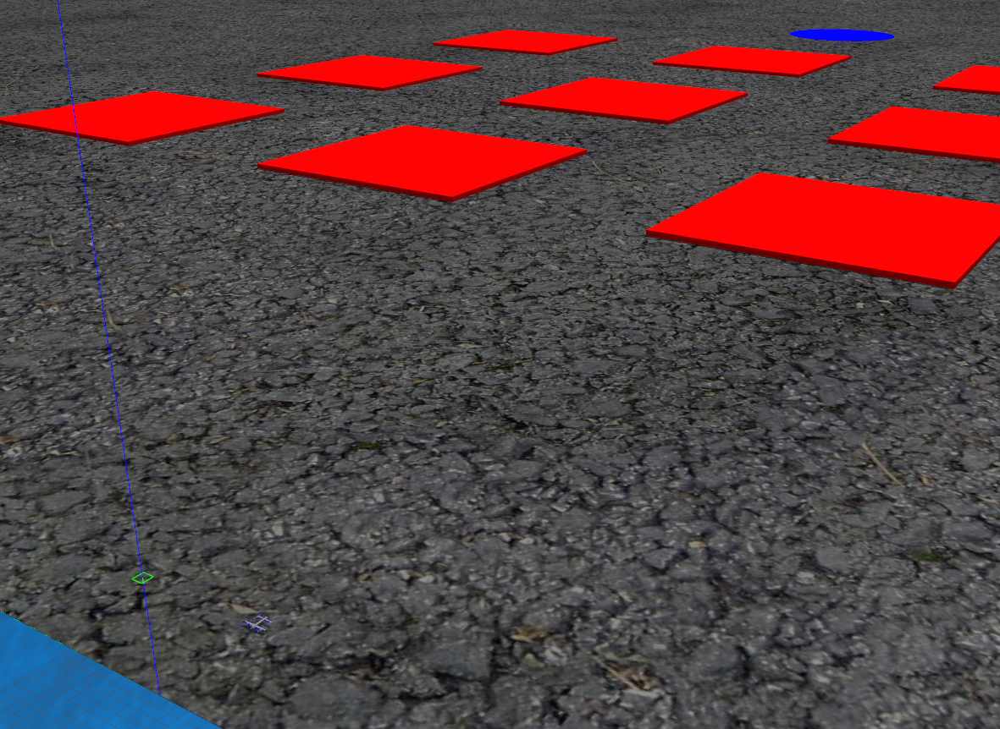

# Custom World Template for Aware4 Docker

A template to generate custom world for [Aware4 Docker](https://hub.docker.com/r/aware4docker/qtr-px4-ros2-docker-foxy) simulator.

## Development

In order to generate custom world in the simulator, you need to modify three files.

1. Create your own models, worlds, and scenarios. Save it under folders `models`, `worlds`, and `scenarios`, respectively.
2. In `sitl_target.cmake` look for the following line, and add your world name at the end
    ```
    set(worlds
        none
        baylands
        ...
        <WORLD_NAME>
    )
    ```
3. In `docker_init.sh`, look for the line after `--name cisim` and make sure you bind your Gazebo models and worlds by adding the following code
    - For gazebo models,
        ```
        -v $(pwd)/models/<MODEL_NAME>:/root/PX4-Autopilot/Tools/sitl_gazebo/models/<MODEL_NAME>\
        ```
    - For gazebo worlds
        ```
        -v $(pwd)/worlds/<WORLD_NAME>.world:/root/PX4-Autopilot/Tools/sitl_gazebo/worlds/<WORLD_NAME>.world\
        ```
    - For scenarios
        ```
        -v $(pwd)/scenarios/<SCENARIO_NAME>.py:/root/px4_ros_com_ros2/build/rtps_command/build/lib/rtps_command/<SCENARIO_NAME>.py\
        ```

## Installation

Before running the simulation you need to install both Docker and CUDA container toolkit. You can follow the guide [here](https://docs.nvidia.com/datacenter/cloud-native/container-toolkit/install-guide.html).

After that, you can run the simulation environment by running the following commands
1. Run the docker container with the provided script
    ```
    sudo ./docker_init.sh
    ```
2. Build your custom world
    ```
    cd ~/PX4-Autopilot/
    make px4_sitl_rtps gazebo
    ```
3. After the build finished, stop the running script
4. Deploy the generated gazebo environment
    ```
    ~/test_process.sh /root/PX4-Autopilot/ /root/px4_ros_com_ros2/ <SCENARIO_NAME>.py 0 QTR:1 <WORLD_NAME> <NUM_VEHICLES>
    ----
    Example:
    ~/test_process.sh /root/PX4-Autopilot/ /root/px4_ros_com_ros2/ test_scenario.py 0 QTR:1 muin_area 1
    ```


## Simulation

Video simulation: https://www.youtube.com/watch?v=91cikrIAtM8



## Todo List

- [ ] Generate scenario script for multi-vehicles