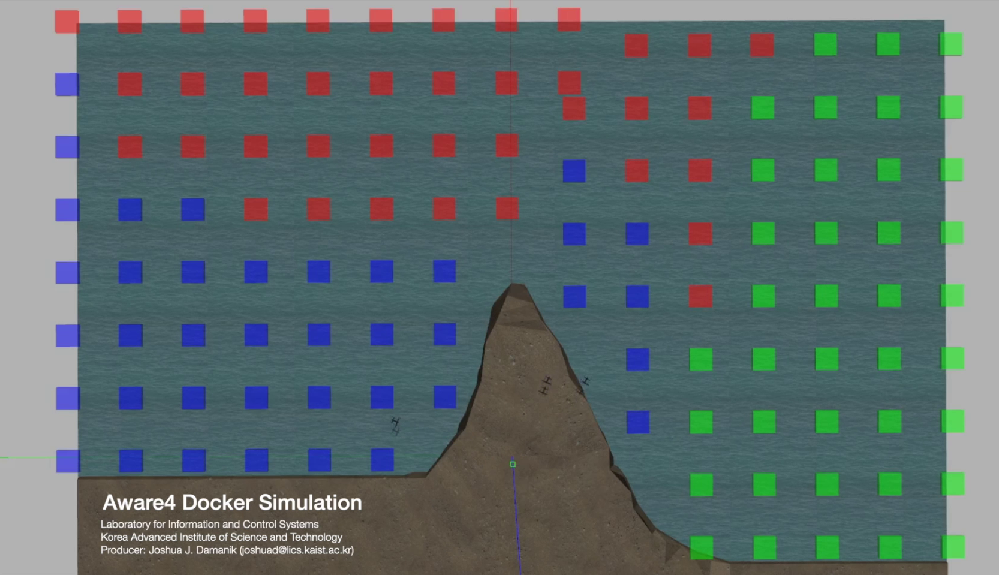

# Aware4 Docker Loader Script

A loader script of [Aware4 Docker](https://hub.docker.com/r/aware4docker/qtr-px4-ros2-docker-foxy) simulator.

---

## Installation

Before running the simulation, make sure you have NVIDIA driver, Docker, and CUDA container toolkit.
1. To install latest NVIDIA driver, [click here](https://www.linuxcapable.com/how-to-install-nvidia-drivers-on-ubuntu-22-04-lts/)
2. To install Docker, [click here](https://docs.docker.com/engine/install/ubuntu/)
3. To install CUDA container toolkit, [click here](https://docs.nvidia.com/datacenter/cloud-native/container-toolkit/install-guide.html)

After installing required software, run the simulation by performing command
```
./run.sh <scenario_name>

ex: ./run.sh illegal_fishing
```


## Development

In order to generate custom world in the simulator, you need to create a new folder on the main path (e.g. `your_scenario`). The structure of the scenario folder must follow the following structure
```
    your_scenario
      - models            # contains all gazebo models needed
          - model_1
          - model_2
          - ...
      - initial.config    # initial configuration of the vehicles
      - main.py           # scenario script to run
      - main.world        # gazebo world file
      - ...
      
```

    ```

## Simulation

Video simulation: https://youtu.be/3bKaz8cqA4k



## Copyright

Joshua Julian Damanik</br>
Laboratory for Information and Control Systems</br>
Korea Advanced Institute of Science and Technology